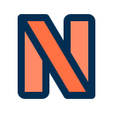

[![Contributors][contributors-shield]][contributors-url]
[![Forks][forks-shield]][forks-url]
[![Stargazers][stars-shield]][stars-url]
[![Issues][issues-shield]][issues-url]
[![MIT License][license-shield]][license-url]
[![LinkedIn][linkedin-shield]][linkedin-url]

<!-- PROJECT LOGO -->
<br />
<p align="center">
  <a href="https://github.com/SAIIsmael/netflixClone">
    
  </a>

  <h3 align="center">Netflix clone</h3>

  <p align="center">
    A simple netflix clone using MERN stack.
    <br />
    <a href="https://github.com/SAIIsmael/netflixClone/readme.md"><strong>Explore the docs »</strong></a>
    <br />
    <br />
    <a>View Demo</a>
    ·
    <a href="https://github.com/SAIIsmael/netflixClone/issues">Report Bug</a>
    ·
    <a href="https://github.com/SAIIsmael/netflixClone/issues">Request Feature</a>
  </p>
</p>

<!-- TABLE OF CONTENTS -->
<details open="open">
  <summary>Table of Contents</summary>
  <ol>
    <li>
      <a href="#about-the-project">About The Project</a>
      <ul>
        <li><a href="#built-with">Built With</a></li>
      </ul>
    </li>
    <li>
      <a href="#getting-started">Getting Started</a>
      <ul>
        <li><a href="#prerequisites">Prerequisites</a></li>
        <li><a href="#installation">Installation</a></li>
      </ul>
    </li>
    <li><a href="#license">License</a></li>
    <li><a href="#contact">Contact</a></li>
    <li><a href="#acknowledgements">Acknowledgements</a></li>
  </ol>
</details>

<!-- ABOUT THE PROJECT -->

## About The Project

[![Preview][preview-screenshot]](https://github.com/SAIIsmael/netflixClone)

This application is a clone of netflix. It emulates the basic features of the famous video on demand website: Netflix.

Indeed, this web application is equipped with :

- a registration system
- an authentication system via Json web token
- the possibility to create, modify, delete or consult a movie or a series
- the possibility to create, modify, delete or consult a list of movies/series.

### Built With

Netflix clone has been developed with the MERN stack. The application can be divided into three big blocks: the data storage managed by the noSQL DBMS mongodb, the backend managed by the javascript framework node.js and the express framework, and, the frontend which is developed via the javascript framework React.

<p align="center">


</p>
<br/>
<!-- GETTING STARTED -->

## Getting Started

This section will describe the installation procedure of the application. It is intended to be installed locally for educational purposes.

### Prerequisites

This is an example of how to list things you need to use the software and how to install them.

- npm
  ```sh
  npm install npm@latest -g
  ```

### Installation

1. Get a free API Key at [https://example.com](https://example.com)
2. Clone the repo
   ```sh
   git clone https://github.com/your_username_/Project-Name.git
   ```
3. Install NPM packages
   ```sh
   npm install
   ```
4. Enter your API in `config.js`
   ```JS
   const API_KEY = 'ENTER YOUR API';
   ```

<!-- LICENSE -->

## License

Distributed under the MIT License. See `LICENSE` for more information.

<!-- CONTACT -->

## Contact

Your Name - [@your_twitter](https://twitter.com/your_username) - email@example.com

Project Link: [https://github.com/your_username/repo_name](https://github.com/your_username/repo_name)

<!-- ACKNOWLEDGEMENTS -->

## Acknowledgements

- <div>N icon designed by <a href="https://www.flaticon.com/fr/auteurs/bqlqn" title="bqlqn">bqlqn</a> from <a href="https://www.flaticon.com/fr/" title="Flaticon">www.flaticon.com</a></div>
- <div>Markdown template designed by <a href="https://github.com/othneildrew" title="othneildrew">othneildrew</a></div>
- <div> <a href="https://www.youtube.com/c/LamaDev">Lamadev</a>'s tutorial</div>
  <!-- MARKDOWN LINKS & IMAGES -->
  <!-- https://www.markdownguide.org/basic-syntax/#reference-style-links -->

[contributors-shield]: https://img.shields.io/github/contributors/othneildrew/Best-README-Template.svg?style=for-the-badge
[contributors-url]: https://github.com/othneildrew/Best-README-Template/graphs/contributors
[forks-shield]: https://img.shields.io/github/forks/othneildrew/Best-README-Template.svg?style=for-the-badge
[forks-url]: https://github.com/othneildrew/Best-README-Template/network/members
[stars-shield]: https://img.shields.io/github/stars/othneildrew/Best-README-Template.svg?style=for-the-badge
[stars-url]: https://github.com/othneildrew/Best-README-Template/stargazers
[issues-shield]: https://img.shields.io/github/issues/othneildrew/Best-README-Template.svg?style=for-the-badge
[issues-url]: https://github.com/othneildrew/Best-README-Template/issues
[license-shield]: https://img.shields.io/github/license/othneildrew/Best-README-Template.svg?style=for-the-badge
[license-url]: https://github.com/othneildrew/Best-README-Template/blob/master/LICENSE.txt
[linkedin-shield]: https://img.shields.io/badge/-LinkedIn-black.svg?style=for-the-badge&logo=linkedin&colorB=555
[linkedin-url]: https://linkedin.com/in/othneildrew
[preview-screenshot]: ./ressources/img/preview.png
